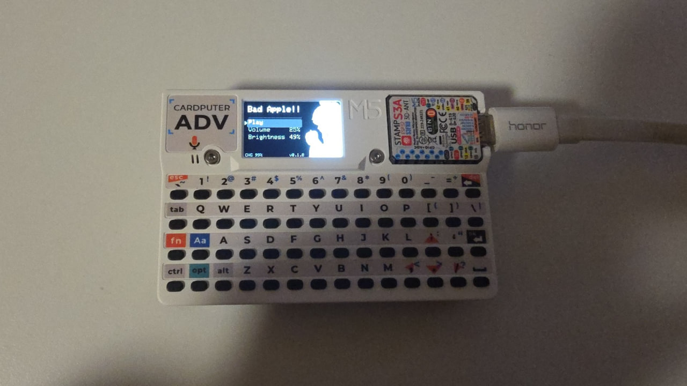

# Bad Apple!! on M5Stack Cardputer ADV

My friend gift me a M5Stack Cardputer ADV, which have a screen and a buzzer. So why not play Bad Apple!! on it?



## Requirements

For running the firmware:

- M5Stack Cardputer ADV

For building the firmware:

- [PlatformIO](https://platformio.org/) ([PlatformIO Core](https://platformio.org/install/cli) also works)
- [ffmpeg](https://ffmpeg.org/)
- [Python 3](https://www.python.org/)

## How to build

### Setup Environment

Setup `PlatformIO` `ffmpeg` and `python3` as mentioned above.

### Generate Data Files

The data files are stored as C Header files, but they are extra large, so they are gitignored.

Follow the instructions in [tools/README.md](tools/README.md) to generate the required data files.

### Build Firmware

```bash
pio run
```

Then the firmware binary will be generated in `.pio/build/m5stack-stamps3/firmware.bin`. This firmware binary works fine in the [Firmware Launcher](https://github.com/bmorcelli/Launcher).

If you want to flash it directly to your Cardputer, simply run:

```bash
pio run --target upload
```

## License

This project is licensed under the MIT License. See the [LICENSE](LICENSE) file for details.

## Credits

- [Bad Apple!! video on YouTube](https://www.youtube.com/watch?v=FtutLA63Cp8)
- [M5Stack Cardputer Library](https://registry.platformio.org/libraries/m5stack/M5Cardputer)
